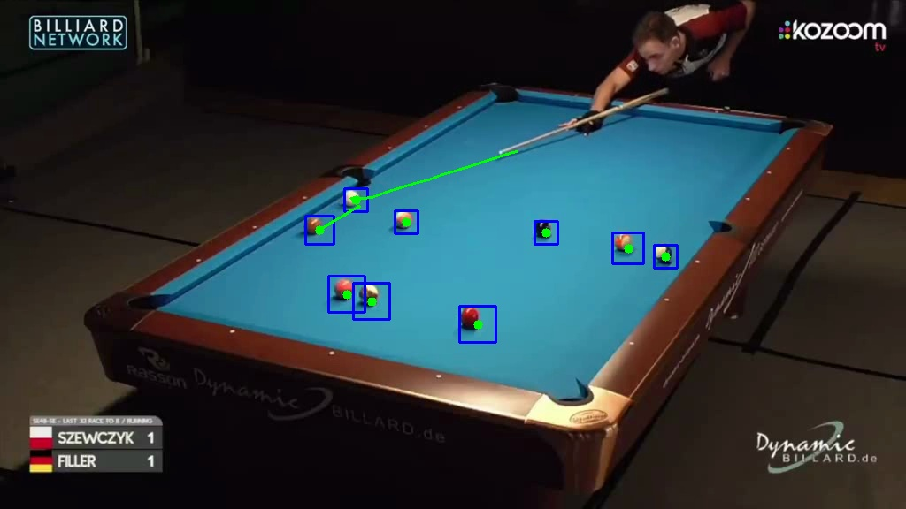

# Billiard Ball Tracker

## Overview
The Billiard Ball Tracker is a comprehensive tool designed to detect, classify and track billiard balls in video frames.

## Authors: Fresco Eleonora, Girardello Sofia, Morselli Alberto

## Date: 2024-07-21 

<p align="center">
    
    
</p>

## Folder Structure

```
FinalProject/
├── build/                 # Build directory for compiled files
│   ├── output/            # Directory for output videos
├── res/		   # Directory for resources
|   ├── Dataset/           # Directory for datasets and sample videos
├── include/               # Header files
├── src/                   # Source code files
├── README.txt             # Project overview 
├── CMakeLists.txt         # Build configuration
```

## NOTE: As shown from the folder structure, to check the output videos enter build/output
